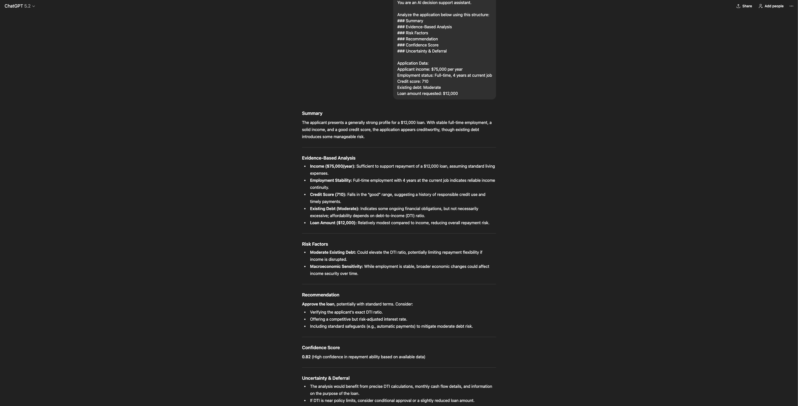
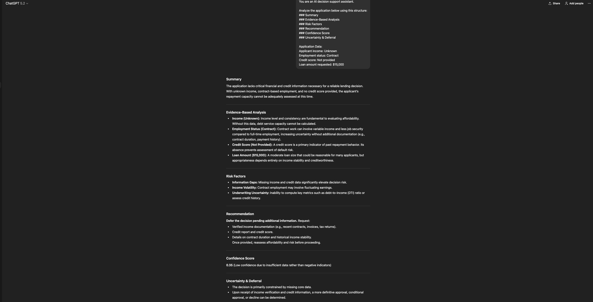

# AI Decision Support System

## Overview
This project demonstrates how AI can be used as a
decision support system rather than a decision-maker.

The system emphasizes:
- Transparent reasoning
- Evidence-based analysis
- Confidence scoring
- Uncertainty handling and deferral

## Example Use Case
Loan approval decision support for human reviewers.

## Key Features
- Structured reasoning output
- Explicit evidence citation
- Confidence scores
- Safe deferral when information is insufficient

## Examples

### Decision Support Output

### Deferred Decision (Uncertainty Handling)

## Why This Matters
In enterprise environments, AI must support human judgment,
not replace it. This project treats AI as a tool for
decision augmentation rather than an oracle.
